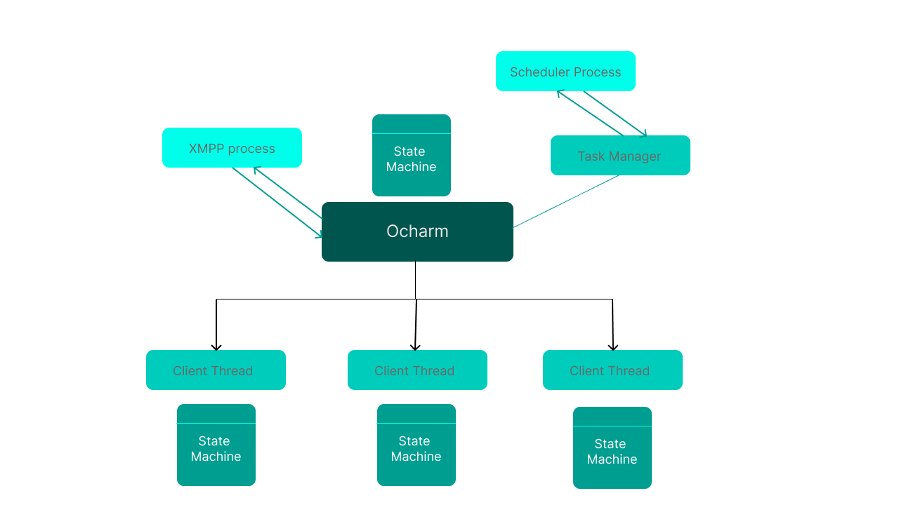

# Ocharm AI Assistant


A Stand-alone natural language conversational assistant to manage your day-to-day tasks by reminding you the tasks at the correct time.


[](https://choosealicense.com/licenses/mit/)


## Design
The main entry point: **```ocharm.py```**

It has two different processes:
**```XMPPProcess``` and ```Scheduler```**



#### XMPP Process:
* Runs a non-blocking loop 
* Waits for an XMPP message either from ocharm or from a client
* Sends the XMPP message to the target

#### Scheduler Process:
* Runs a non-blocking loop
* Checks for an event from ```ocharm->taskmanager```
* If there are any events process the event.
* Checks for any tasks that are currently due, and notify them for the relavant party
* Checks if there are any pending tasks that has not being done and notify them for the relavant party

#### Client Thread:
Each client that connects to Ocharm get's it's own thread, which will be a state machine.

* Runs a blocking loop
* Waits for a message from the client that owns the thread
* Uses a **```Langchain```** agent to classify the user message to state in the state machine
* Processes the state
* If there is insufficient information from the user ask them for that information and wait for a message by blocking the thread


## Feedback

If you have any feedback, please reach out to me at devdude@wondersplot.co.nz

